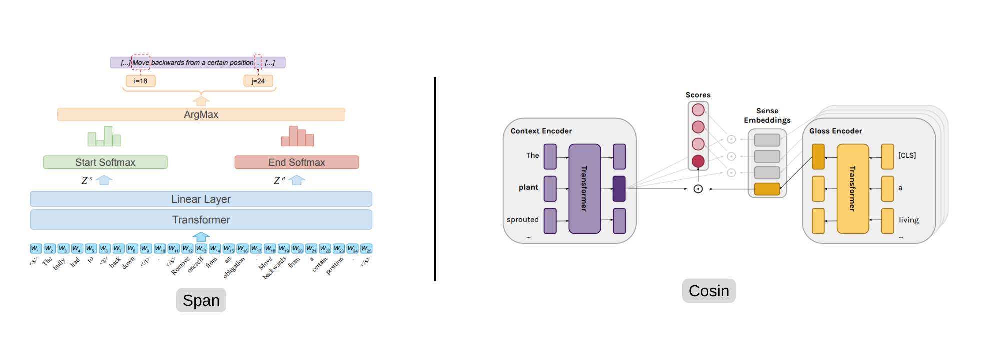

Copyright (c), [Barba](https://aclanthology.org/2021.naacl-main.371/) and [Blevins](https://aclanthology.org/2020.acl-main.95/).
# Word Sense Disambiguation (WSD) 
This project implements algorithms and tools for Word Sense Disambiguation (WSD), the task of determining the correct meaning of a word based on its context in a sentence. It provides datasets, evaluation scripts, and models to facilitate research and development in natural language processing applications where accurate word sense interpretation is essential.

## Project Structure
```
📁 Word Sense Disambiguation (WSD)
    ├── 📄 .gitignore
    ├── 📄 LICENSE
    ├── 📄 README.md
    ├── 📄 config.yaml
    ├── 📄 requirements.txt
    ├── 📄 download.sh
    │
    ├── 🧠 Core Modules
    │   ├── 📄 model.py
    │   ├── 📄 predict.py
    │   ├── 📄 train.py
    │
    ├── 🧰 Utilities
    │   ├── 📄 train_utils.py
    │   ├── 📄 utils.py
    │   ├── 📄 wn_utils.py
    │
    ├── 📊 Data
    │   ├── 📄 dataset.py
    │   ├── 📄 data_builder.py
    │
```
## Setup
This project requires `python=3.10`

```bash
pip install -r requirements.txt
```

## Training 

```bash
python train.py -c config.yaml
```
with following configations
```yaml
train_data_dir: data/Training_Corpora/SemCor        # Training dataset dir
val_data_dir: data/Evaluation_Datasets/semeval2007  # Validation dataset dir
model_name: distilbert-base-uncased                 # Huggingface model name
output_dir: output                                  # output directory to save checkpoints
num_sense: 5                                        # Recommended 4/5
max_seq_len: 512                                    # Between [1, 512]
batch_size: 16                                      # Batch size for training
lr: 0.00001                                         # Learning rate
weight_decay: 0.01                                  # Weight decay for optimizer
epochs: 3                                           # Number of epochs
logging_step: 2000                                  # After how many steps to log
precision: fp16                                     # [fp16, fp32, bf16]
warmup_ratio: 0.1                                   # After how many steps to warmup
grad_clip: 1.0                                      # Gradient clipping factor
pos_tag: ALL                                        # [ALL, NOUN, VERB, ADJ, ADV]
device: cuda                                        # [cpu, cuda]
seed: 1234                                          # [int,  none]
report_to: wandb                                    # [wandb, none]
architecture: span                                  # [span, cosine]
do_predict: true                                    # predict after training
```

## Evaluation
```bash
python predict.py \
    --data_dir "data/Evaluation_Datasets/semeval2015" \
    --model_name "distilbert-base-uncased" \
    --weight_dir "output/semeval2007" \
    --pos "ALL" \
    --seed 1234 \
    --num_sense 5 \
    --max_length 256 \
    --batch_size 32 \
    --architecture "cosine"
```


## Evaluation Results

### Span Extraction
| Dataset     | Loss   | Start F1 | End F1 | Exact Match | Joint F1 | POS  | Architecture |
|-------------|--------|----------|--------|--------------|----------|------|-------------|
| ALL         | 0.512  | 0.8129   | 0.8170 | 0.7962       | 0.8087   | ALL  | span        |
| semeval2007 | 0.517  | 0.8088   | 0.8088 | 0.7934       | 0.8037   | ALL  | span        |
| semeval2013 | 0.524  | 0.8054   | 0.8096 | 0.7835       | 0.7995   | ALL  | span        |
| semeval2015 | 0.611  | 0.7916   | 0.7955 | 0.7769       | 0.7880   | ALL  | span        |
| senseval2   | 0.527  | 0.8094   | 0.8146 | 0.7927       | 0.8056   | ALL  | span        |
| senseval3   | 0.476  | 0.8151   | 0.8232 | 0.8043       | 0.8142   | ALL  | span        |

### Cosine Similarity
| Dataset     | Loss   | F1     | Precision | Recall | Accuracy | POS  | Architecture |
|-------------|--------|--------|-----------|--------|----------|------|---------------|
| ALL         | 0.5684 | 0.8024 | 0.8024    | 0.8024 | 0.8024   | ALL  | cosine        |
| semeval2007 | 0.5524 | 0.8066 | 0.8066    | 0.8066 | 0.8066   | ALL  | cosine        |
| semeval2013 | 0.4821 | 0.8303 | 0.8303    | 0.8303 | 0.8303   | ALL  | cosine        |
| semeval2015 | 0.6726 | 0.7965 | 0.7965    | 0.7965 | 0.7965   | ALL  | cosine        |
| senseval2   | 0.5827 | 0.7993 | 0.7993    | 0.7993 | 0.7993   | ALL  | cosine        |
| senseval3   | 0.5064 | 0.8000 | 0.8000    | 0.8000 | 0.8000   | ALL  | cosine        |


## Dataset Details

### [Training](https://lcl.uniroma1.it/wsdeval/training-data)
- SemCor
- SemCor+OMSTI
### [Evaluation](https://lcl.uniroma1.it/wsdeval/evaluation-data)
- SemEval 2007
- SemEval 2013
- SemEval 2015
- Senseval 2
- Senseval 3