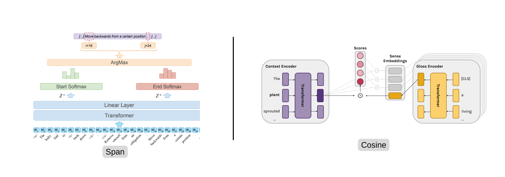

Copyright (c), [Barba](https://aclanthology.org/2021.naacl-main.371/) and [Blevins](https://aclanthology.org/2020.acl-main.95/).
# Word Sense Disambiguation (WSD) 
This project implements algorithms and tools for Word Sense Disambiguation (WSD), the task of determining the correct meaning of a word based on its context in a sentence. It provides datasets, evaluation scripts, and models to facilitate research and development in natural language processing applications where accurate word sense interpretation is essential.

## Project Structure
```
📁 Word Sense Disambiguation (WSD)
    ├── 📄 .gitignore
    ├── 📄 LICENSE
    ├── 📄 README.md
    ├── 📄 config.yaml
    ├── 📄 requirements.txt
    ├── 📄 download.sh
    │
    ├── 🧠 Core Modules
    │   ├── 📄 model.py
    │   ├── 📄 predict.py
    │   ├── 📄 train.py
    │
    ├── 🧰 Utilities
    │   ├── 📄 train_utils.py
    │   ├── 📄 utils.py
    │   ├── 📄 wn_utils.py
    │
    ├── 📊 Data
    │   ├── 📄 dataset.py
    │   ├── 📄 data_builder.py
    │
```
## Setup
This project requires `python=3.10`

```bash
pip install -r requirements.txt
```

## Training 

```bash
python train.py -c config.yaml
```
with following configations
```yaml
train_data_dir: data/Training_Corpora/SemCor
val_data_dir: data/Evaluation_Datasets/semeval2007
model_name: distilbert-base-uncased
output_dir: output/semeval2007
num_sense: 5            # Recommended 4/5
max_seq_len: 20         # Between [1, 512]
batch_size: 1
lr: 0.00001
weight_decay: 0.01
epochs: 3
logging_step: 10
precision: fp16         # [fp16, fp32, bf16]
warmup_ratio: 0.1
grad_clip: 1.0
pos_tag: ALL            # [ALL, NOUN, VERB, ADJ, ADV]
device: cpu             # [cpu, cuda]
seed: 1234              # [int,  none]
report_to: wandb        # [wandb, none]
architecture: span      # [span, cosine]
```

## Evaluation
```bash
python predict.py --data_dir "data/Evaluation_Datasets/semeval2015" \
                  --model_name "distilbert-base-uncased" \
                  --weight_dir "output/semeval2007" \
                  --pos "ALL" \
                  --num_sense 5 \
                  --max_length 256 \
                  --batch_size 32 \
                  --architecture "span"
```

## Dataset Details

### [Training](https://lcl.uniroma1.it/wsdeval/training-data)
- SemCor
- SemCor+OMSTI
### [Evaluation](https://lcl.uniroma1.it/wsdeval/evaluation-data)
- SemEval 2007
- SemEval 2013
- SemEval 2015
- Senseval 2
- Senseval 3
